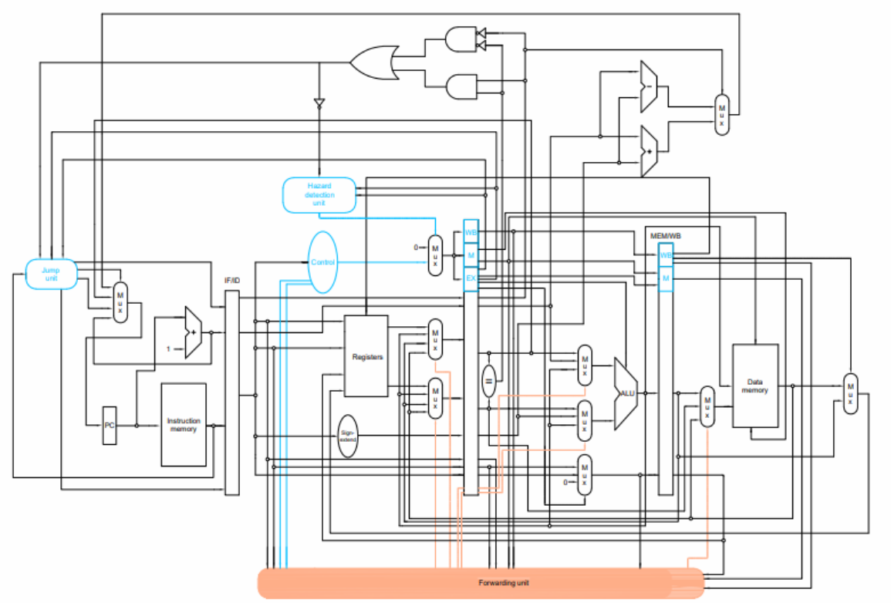
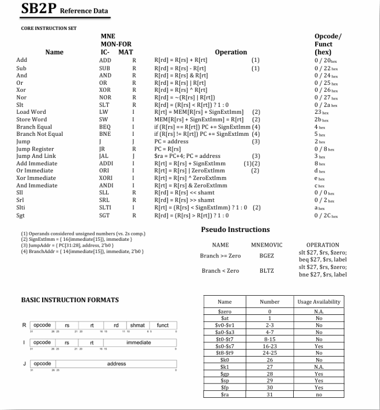
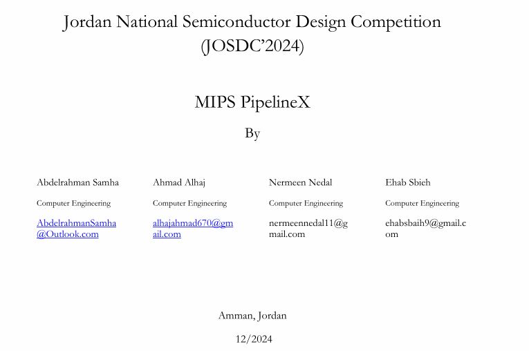

Pipelined designs are said to be far better from signlecycled designs, this project aims to demonstrate and proof this concept, by designing and evaluating both processors and test their performance. 
in the document (SB2P_Development Phase.pdf) the reader can see the steps of desiging both single cycle and pipeline processors, as well as optimizations progress in designing overtime. 
note that these systems are built with the aim of being implemented on FPGAs, therefor some unconventional digital system design methods were used, as it wont be applicable on any technology beside the FPGA. 
at the end of the document we show the evaluation of optimized pipeline designs, and the final evaluation between both design methodologies. 
the last segment of the document shows testing the processors with suffienct programs to proof the functionality. 

Also an Assembler is provided along with the ISA used, to test the design for oneself. 

The Cycle Accurate Simulator (CAS) for the pipeline processor is added only as an executable, but the code is open-sourced in a seperate repo : AbdelrahmanSamha/Multithreaded-CAS-pipeline-MIPS-processor 
Credits can be found at the end of the .readme

# Documentation
[Full PDF here](SB2P_Development.pdf)

# Datapath view 

# refrence sheet 

# Credits

